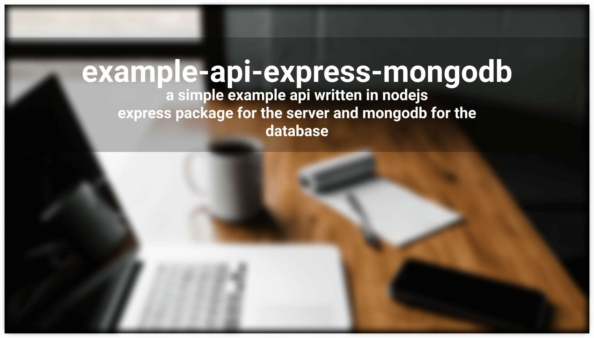

# example-api-express-mongodb

simple example API it will generated docs using express and mongodb

## Configuration has to be created:

**config/config.env**

- NODE_ENV
- PORT
- MONGO_URI

## Dependencies

- express
- mongoose
- dotenv
- morgan
- slugify

## Devdependencies

- nodemon
